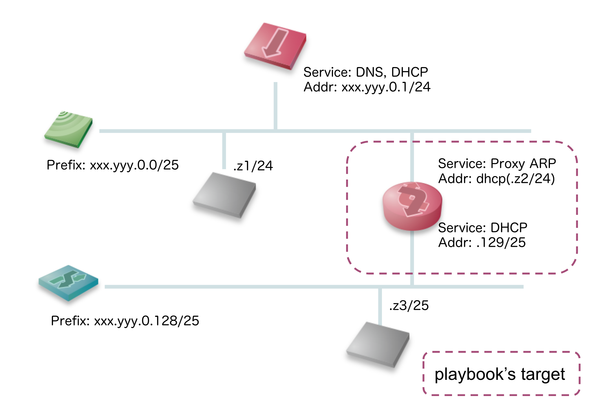

ansible_playbook.raspi_bridge-segment-overlapping
---

このプレイブックでは、WDS bridgingのないWi-Fiルーター配下に擬似的にL2スイッチを接続します。あらかじめ Wi-Fi接続が可能でssh接続可能なDebian系のホストを準備してください。また家庭用で、ネットワーク機器であるため勝手に再起動しません。設定後はターゲットにログインして再起動を行なってください。



## 使い方

設定のカスタマイズは *./inventories/host.yml.example* や *.envrc.example*　を参考にしてください。

### setup (controller)
必要な Ansible などを *poetry* でインストールします。

```sh
poetry install
poetry shell
```

### setup (target)

```sh
# in controller
ansible-playbook -i ./inventories/home.yml ./playbook.yml
ssh $remote_user@raspberrypi.local
# in target
sudo reboot now
```